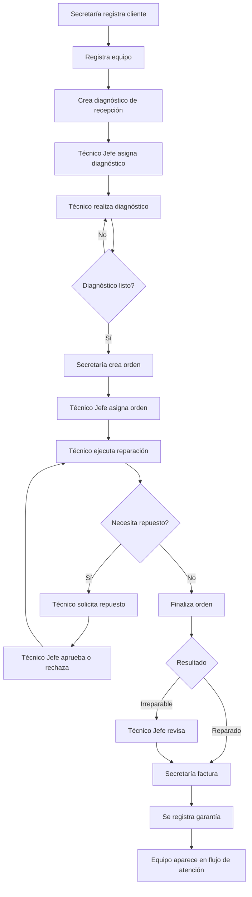

# Casos de uso y funciones del sistema CTE

## 1. Propósito

CTE es una aplicación para administrar la operación de un Centro Técnico Electrónico. Permite registrar clientes y equipos, recibir equipos para diagnóstico, coordinar reparaciones, controlar repuestos y compras, facturar servicios y gestionar garantías.

Este documento describe las funciones implementadas en el frontend y en la API del proyecto.

## 2. Actores

| Actor | Descripción |
| --- | --- |
| Visitante | Persona que accede al sistema sin autenticarse. Solo puede iniciar sesión. |
| Secretaria | Registra la recepción y la información operativa: clientes, equipos, diagnósticos, órdenes, inventario, compras, proveedores, facturas y garantías. |
| Técnico | Atiende los diagnósticos y órdenes que le fueron asignados; actualiza avances y solicita repuestos. |
| Técnico Jefe | Coordina al equipo técnico, asigna trabajos, aprueba solicitudes y revisa casos especiales. |
| Administrador | Administra la operación completa y consulta indicadores, reportes e historiales. |
| `admin_pro` | Administrador con acceso al módulo avanzado, respaldos, monitoreo y analítica ampliada. |
| Sistema | API, base de datos, notificaciones, auditoría y tareas automáticas. |

> La autorización de las operaciones se realiza principalmente en el backend. El frontend muestra menús y pantallas según el rol, pero el control definitivo debe hacerse siempre en la API.

## 3. Reglas generales

- El usuario debe autenticarse mediante usuario y contraseña.
- Las operaciones protegidas requieren un token JWT válido.
- Los datos se almacenan en PostgreSQL mediante Prisma y funciones SQL.
- Una orden normalmente se crea a partir de un diagnóstico listo.
- Un diagnóstico y una orden pueden ser asignados a un técnico por el Técnico Jefe.
- Un técnico solo debe trabajar sobre diagnósticos y órdenes asignados a su usuario.
- La facturación se realiza sobre órdenes disponibles para facturar.
- Una garantía se registra asociada a una operación facturada.
- Las operaciones relevantes pueden generar registros de auditoría en PostgreSQL.

## 4. Matriz de funciones por actor

| Función | Secretaría | Técnico | Técnico Jefe | Administrador / `admin_pro` |
| --- | :---: | :---: | :---: | :---: |
| Iniciar sesión | Sí | Sí | Sí | Sí |
| Gestionar clientes y equipos | Sí | No | Según permiso administrativo | Sí |
| Gestionar diagnósticos | Sí | Trabajar asignados | Asignar, revisar y corregir | Sí |
| Gestionar órdenes | Sí | Actualizar asignadas | Asignar y revisar | Sí |
| Consultar flujo de atención | Sí | Según pantalla/permiso | Sí | Sí |
| Gestionar repuestos | Sí | Consultar y solicitar | Consultar y aprobar | Sí |
| Gestionar tipos de repuesto | Sí | No | Según operación | Sí |
| Gestionar compras y proveedores | Sí | No | No | Sí |
| Gestionar facturas y garantías | Sí | No | No | Sí |
| Gestionar usuarios | No | No | No | Sí |
| Consultar reportes y analítica | No | No | No | Sí |
| Crear respaldos manuales | No | No | No | `admin_pro` |

## 5. Casos de uso de autenticación

### CU-01. Iniciar sesión

- **Actor principal:** cualquier usuario registrado.
- **Precondiciones:** el usuario existe y está activo.
- **Flujo principal:**
  1. El usuario abre la pantalla de inicio de sesión.
  2. Introduce sus credenciales.
  3. El sistema valida la contraseña.
  4. La API devuelve la identidad, rol y token JWT.
  5. El frontend dirige al panel correspondiente.
- **Resultado:** el usuario accede a las funciones de su rol.
- **API:** `POST /api/auth/login`.
- **Pantalla:** `/login`.

### CU-02. Cerrar sesión y proteger la sesión

- **Actor principal:** usuario autenticado.
- **Flujo:** el usuario cierra la sesión o pierde su identidad local; las rutas protegidas lo redirigen al login.
- **Resultado:** no puede continuar operando sin autenticarse.
- **Nota:** las rutas frontend usan `RequireAuth`; el backend valida JWT y permisos.

## 6. Casos de uso de recepción y clientes

### CU-03. Gestionar clientes

- **Actor principal:** Secretaría.
- **Flujo:** consultar la lista, registrar un cliente, modificar sus datos o eliminarlo si las reglas del sistema lo permiten.
- **Resultado:** queda disponible el cliente para asociarlo a uno o más equipos.
- **API:** `GET`, `POST`, `PUT /api/clientes/:id`, `DELETE /api/clientes/:id`.
- **Pantallas:** `/secretaria/clientes`, `/admin/clientes`.

### CU-04. Gestionar equipos

- **Actor principal:** Secretaría.
- **Flujo:** consultar, registrar, modificar o eliminar un equipo y asociarlo a un cliente.
- **Resultado:** el equipo queda identificado para su historial, diagnóstico y orden.
- **API:** `GET`, `POST`, `PUT /api/equipos/:id`, `DELETE /api/equipos/:id`.
- **Pantallas:** `/secretaria/equipos`, `/admin/equipos`.

### CU-05. Consultar el historial de un equipo

- **Actor principal:** Administrador o `admin_pro`.
- **Flujo:** seleccionar un equipo y consultar sus diagnósticos, órdenes, facturación, garantías y cambios registrados.
- **Resultado:** se obtiene la trazabilidad operativa del equipo.
- **API:** `GET /api/admin_pro/equipos/:id/historial`.
- **Pantalla:** `/admin/historial-equipo`.

## 7. Casos de uso de diagnóstico

### CU-06. Registrar un diagnóstico de recepción

- **Actor principal:** Secretaría.
- **Flujo:** seleccionar cliente y equipo, registrar la falla reportada y completar los checks de recepción.
- **Resultado:** se crea un diagnóstico pendiente de asignación.
- **API:** `POST /api/secretaria/diagnostico/create`.
- **Pantalla:** `/secretaria/diagnostico`.

### CU-07. Consultar y actualizar diagnósticos administrativos

- **Actores:** Secretaría, Administrador.
- **Flujo:** consultar diagnósticos, editar información y cambiar su estado según el avance de recepción y evaluación.
- **API:** `GET /api/secretaria/diagnostico`, `PUT /api/secretaria/diagnostico/:id`, `PATCH /api/secretaria/diagnostico/:id/estado`.
- **Pantallas:** `/secretaria/diagnostico`, `/admin/diagnosticos`.

### CU-08. Asignar un diagnóstico a un técnico

- **Actor principal:** Técnico Jefe.
- **Precondiciones:** existe un diagnóstico pendiente y un técnico disponible.
- **Flujo:** consultar pendientes, seleccionar técnico y confirmar la asignación.
- **Resultado:** el diagnóstico aparece en la bandeja del técnico asignado.
- **API:** `GET /api/diagnosticos/pendientes-asignar`, `PATCH /api/diagnosticos/:id/asignar`.
- **Pantalla:** `/tecnico-jefe`.

### CU-09. Completar un diagnóstico técnico

- **Actor principal:** Técnico.
- **Flujo:** consultar sus diagnósticos, registrar evaluación, solución propuesta, presupuesto y observaciones, y marcar el diagnóstico como completado o listo para orden.
- **Resultado:** el diagnóstico puede pasar a la creación de una orden.
- **API:** `GET /api/tecnicos/mis-diagnosticos/:username`, `PUT /api/tecnicos/diagnosticos/:id`.
- **Pantalla:** `/tecnico`.

### CU-10. Corregir un diagnóstico

- **Actor principal:** Técnico Jefe.
- **Flujo:** consultar correcciones pendientes, revisar el diagnóstico y aplicar la corrección requerida.
- **Resultado:** el diagnóstico queda corregido o vuelve al circuito de trabajo.
- **API:** `GET /api/diagnosticos/correcciones`, `PATCH /api/diagnosticos/correcciones/diagnosticos/:id`.
- **Pantalla:** `/tecnico-jefe`.

## 8. Casos de uso de órdenes de reparación

### CU-11. Crear una orden de reparación

- **Actor principal:** Secretaría.
- **Precondiciones:** existe un diagnóstico listo para generar una orden.
- **Flujo:** consultar diagnósticos listos, seleccionar uno, completar los datos de la orden y confirmar.
- **Resultado:** se crea una orden pendiente de asignación.
- **API:** `GET /api/ordenes/diagnosticos-listos`, `POST /api/ordenes` o `POST /api/ordenes/create`.
- **Pantallas:** `/secretaria/nueva-orden`, `/admin/ordenes`.

### CU-12. Consultar, editar o eliminar órdenes

- **Actores:** Secretaría, Administrador.
- **Flujo:** consultar órdenes, modificar datos operativos o eliminar una orden cuando sea válido.
- **API:** `GET /api/ordenes`, `PUT /api/ordenes/:id`, `DELETE /api/ordenes/:id`.

### CU-13. Asignar una orden a un técnico

- **Actor principal:** Técnico Jefe.
- **Precondiciones:** la orden está aprobada o lista para asignación.
- **Flujo:** revisar órdenes pendientes, seleccionar técnico y confirmar.
- **Resultado:** la orden aparece entre las órdenes activas del técnico.
- **API:** `GET /api/diagnosticos/ordenes`, `GET /api/diagnosticos/ordenes/aprobadas`, `PATCH /api/diagnosticos/orden/:id/asignar`.
- **Pantalla:** `/tecnico-jefe`.

### CU-14. Actualizar el estado de una orden

- **Actor principal:** Técnico.
- **Flujo:** consultar sus órdenes, iniciar o avanzar la reparación y registrar el estado correspondiente.
- **Resultado:** la orden refleja su avance y puede avanzar a reparación terminada, irreparable o entrega.
- **API:** `GET /api/tecnicos/mis-ordenes/:username`, `PATCH /api/tecnicos/ordenes/:id/estado`.
- **Pantalla:** `/tecnico`.

### CU-15. Revisar una orden irreparable

- **Actor principal:** Técnico Jefe.
- **Flujo:** consultar el caso, revisar la justificación técnica y aprobar o rechazar la condición de irreparable.
- **Resultado:** la orden queda aceptada como irreparable o vuelve a corrección.
- **API:** `PATCH /api/diagnosticos/correcciones/ordenes/:id/irreparable/aprobar` y `PATCH /api/diagnosticos/correcciones/ordenes/:id/irreparable/rechazar`.

### CU-16. Corregir una orden

- **Actor principal:** Técnico Jefe.
- **Flujo:** revisar órdenes con observaciones, editar la información necesaria y guardar la corrección.
- **API:** `PATCH /api/diagnosticos/correcciones/ordenes/:id`.
- **Pantalla:** `/tecnico-jefe`.

## 9. Casos de uso de repuestos e inventario

### CU-17. Gestionar catálogo de repuestos

- **Actores:** Secretaría, Administrador.
- **Flujo:** consultar, crear, editar y eliminar repuestos; consultar tipos/categorías de repuesto.
- **API repuestos:** `GET`, `POST`, `PUT`, `DELETE /api/repuestos/:id`.
- **API tipos:** `GET`, `POST`, `PUT`, `DELETE /api/tipos-repuesto/:id`.
- **Pantallas:** `/secretaria/repuestos`, `/secretaria/tipos-repuesto`, `/admin/repuestos`, `/admin/inventario`.
- **Nota:** técnicos y Técnico Jefe tienen acceso de lectura al catálogo para trabajar y solicitar repuestos.

### CU-18. Solicitar un repuesto para una orden

- **Actor principal:** Técnico.
- **Precondiciones:** el técnico tiene una orden asignada.
- **Flujo:** selecciona el repuesto, indica la cantidad y registra la solicitud.
- **Resultado:** la solicitud queda pendiente de aprobación del Técnico Jefe.
- **API:** `POST /api/tecnicos/ordenes/:id/repuestos`.
- **Pantalla:** `/tecnico`.

### CU-19. Aprobar o rechazar una solicitud de repuesto

- **Actor principal:** Técnico Jefe.
- **Flujo:** consulta solicitudes pendientes, revisa disponibilidad y necesidad, y aprueba o rechaza cada solicitud.
- **Resultado:** el inventario y la orden se actualizan según la decisión.
- **API:** `GET /api/diagnosticos/repuestos/pendientes-aprobacion`, `PATCH /api/diagnosticos/repuestos/:id/aprobar`, `PATCH /api/diagnosticos/repuestos/:id/rechazar`.
- **Pantalla:** `/tecnico-jefe`.

### CU-20. Corregir el uso de un repuesto

- **Actor principal:** Técnico Jefe.
- **Flujo:** revisa el registro de repuesto observado y aplica la corrección.
- **API:** `PATCH /api/diagnosticos/correcciones/repuestos/:id`.

### CU-21. Gestionar proveedores

- **Actores:** Secretaría, Administrador.
- **Flujo:** consultar, registrar, editar y eliminar proveedores.
- **API:** `GET`, `POST`, `PUT`, `DELETE /api/proveedores/:id`.
- **Pantallas:** `/secretaria/proveedores`, `/admin/compras`.

### CU-22. Registrar y consultar compras

- **Actores:** Secretaría, Administrador.
- **Flujo:** consultar compras, registrar una compra de repuestos y actualizar sus datos.
- **Resultado:** el abastecimiento queda registrado y disponible para el control de inventario.
- **API:** `GET`, `POST`, `PUT /api/compras/:id`.
- **Pantallas:** `/secretaria/compras`, `/admin/compras`.

## 10. Casos de uso de facturación y garantías

### CU-23. Facturar una orden

- **Actores:** Secretaría, Administrador.
- **Precondiciones:** existe una orden disponible para facturar.
- **Flujo:** consultar órdenes disponibles, seleccionar una, introducir datos de facturación y confirmar.
- **Resultado:** se registra la factura de la reparación.
- **API:** `GET /api/facturas/ordenes-disponibles`, `GET /api/facturas`, `POST /api/facturas`.
- **Pantallas:** `/secretaria/facturacion`, `/admin/facturacion`.

### CU-24. Registrar y consultar garantías

- **Actores:** Secretaría, Administrador.
- **Flujo:** consultar garantías y registrar una garantía asociada a la factura u orden correspondiente.
- **Resultado:** el servicio queda cubierto durante el periodo registrado.
- **API:** `GET`, `POST /api/garantias`.
- **Pantallas:** `/secretaria/facturacion`, `/admin/garantias`.

### CU-25. Administrar garantías avanzadas

- **Actor principal:** Administrador o `admin_pro`.
- **Flujo:** consultar, crear, editar y renovar garantías; revisar las próximas a vencer.
- **API:** `GET /api/admin_pro/garantias`, `POST /api/admin_pro/garantias`, `PUT /api/admin_pro/garantias/:id`, `POST /api/admin_pro/garantias/:id/renovar`.
- **Pantalla:** `/admin/garantias`.

## 11. Casos de uso de coordinación y flujo de atención

### CU-26. Consultar el flujo de atención de un equipo

- **Actores:** Secretaría, Técnico Jefe, Administrador.
- **Flujo:** abrir el flujo, filtrar por estado y buscar por cliente, equipo u otra información disponible.
- **Resultado:** se visualiza en qué etapa se encuentra cada equipo.
- **Estados consolidados:** `en-revision`, `listos-orden`, `en-reparacion`, `pendientes`, `listos-facturar`, `entregados`, `con-garantia`.
- **API:** `GET /api/flujo-atencion?filtro=...&search=...`.
- **Pantallas:** `/secretaria/flujo-atencion`, `/admin/flujo-atencion`.

### CU-27. Consultar notificaciones en tiempo real

- **Actores:** Técnico y Técnico Jefe.
- **Flujo:** el sistema envía avisos cuando se asignan trabajos, se solicitan repuestos o se requiere una revisión; el usuario recibe la notificación en su bandeja.
- **Resultado:** los responsables conocen cambios relevantes sin tener que recargar manualmente.
- **Implementación:** Socket.IO con autenticación JWT, salas por rol/usuario y notificaciones del navegador.

## 12. Casos de uso administrativos avanzados

### CU-28. Consultar el dashboard administrativo

- **Actor principal:** Administrador o `admin_pro`.
- **Resultado:** visualiza métricas globales, finanzas, productividad, órdenes, diagnósticos, garantías próximas a vencer y estado general del negocio.
- **API:** `GET /api/admin_pro/dashboard`.
- **Pantalla:** `/admin`.

### CU-29. Gestionar usuarios

- **Actor principal:** Administrador o `admin_pro`.
- **Flujo:** consultar usuarios, crear cuentas, editar datos/estado activo, cambiar contraseñas y eliminar usuarios.
- **API:** `GET`, `POST`, `PUT /api/admin_pro/usuarios/:id`, `PUT /api/admin_pro/usuarios/:id/password`, `DELETE /api/admin_pro/usuarios/:id`.
- **Pantalla:** `/admin/usuarios`.

### CU-30. Consultar productividad y ganancias

- **Actor principal:** Administrador o `admin_pro`.
- **Flujo:** seleccionar filtros o periodo y consultar indicadores de rendimiento técnico y ganancias.
- **API:** `GET /api/admin_pro/analitica/productividad`, `GET /api/admin_pro/analitica/ganancias`.
- **Pantallas:** `/admin/tecnicos`, `/admin/ganancias`.

### CU-31. Consultar reportes parametrizados

- **Actor principal:** Administrador o `admin_pro`.
- **Tipos de reporte:** resumen, repuestos usados, repuestos por proveedor, compras, facturación, técnicos, órdenes por estado, diagnósticos por estado, equipos por cliente, garantías por vencer e inventario.
- **API:** `GET /api/admin_pro/reportes/:tipo`.
- **Resultado:** se obtiene información consolidada para control y toma de decisiones.

### CU-32. Consultar historiales operativos

- **Actor principal:** Administrador o `admin_pro`.
- **Funciones:** consultar el historial de un equipo y el historial de un repuesto, incluyendo sus movimientos asociados.
- **API:** `GET /api/admin_pro/equipos/:id/historial`, `GET /api/admin_pro/repuestos/:id/historial`.
- **Pantallas:** `/admin/historial-equipo`, `/admin/historial-repuesto`.

### CU-33. Consultar monitoreo general

- **Actor principal:** `admin_pro`.
- **Flujo:** abrir el monitor administrativo y revisar el estado agregado de la aplicación y sus operaciones.
- **API:** `GET /api/admin_pro/monitoreo`.
- **Pantalla:** disponible desde el panel administrativo avanzado.

### CU-34. Crear y consultar respaldos

- **Actor principal:** `admin_pro`.
- **Flujo:** consultar respaldos existentes o ejecutar un respaldo manual.
- **Resultado:** se genera un respaldo mediante `pg_dump` cuando está disponible o mediante snapshot JSON como alternativa.
- **API:** `GET /api/admin_pro/backups`, `POST /api/admin_pro/backups/manual`.
- **Automatización:** existe respaldo mensual programado.

## 13. Funciones transversales

### Personalización de apariencia

- Cambio entre tema claro y oscuro.
- Persistencia de la elección en `localStorage`.
- Aplicación global mediante `data-theme` y `color-scheme`.
- Disponible mediante el control de personalización de la interfaz.

### Auditoría

- PostgreSQL mantiene la tabla `Auditoria_Movimientos`.
- Triggers registran operaciones sobre usuarios, técnicos, clientes, equipos, diagnósticos, órdenes, inventario, proveedores, compras, facturas y garantías.
- Se pueden guardar operación, datos anteriores, datos nuevos, usuario y fecha.
- Existe captura manual del estado actual mediante `auditoria_capturar_estado_actual`.
- Actualmente no hay una pantalla frontend ni una ruta API específica para consultar la auditoría.

### Estado de salud de la API

- `GET /health`.
- `GET /api/health`.
- Comprueba la conexión con PostgreSQL mediante `SELECT 1`.

### Seguridad y operación de la API

- CORS configurable por variables de entorno.
- Cabeceras HTTP de seguridad.
- Identificador `X-Request-Id` por solicitud.
- Registro de solicitudes mediante Morgan.
- Manejo centralizado de errores y rutas no encontradas.
- Límite configurable para cuerpos JSON y formularios.

## 14. Flujo completo de atención

## 15. Catálogo resumido de endpoints

| Módulo | Operaciones |
| --- | --- |
| Autenticación | `POST /api/auth/login` |
| Clientes | CRUD en `/api/clientes` |
| Equipos | CRUD en `/api/equipos` |
| Diagnóstico de Secretaría | listar, crear, editar y cambiar estado en `/api/secretaria/diagnostico` |
| Órdenes | listar, crear, editar, eliminar y listar diagnósticos listos en `/api/ordenes` |
| Técnicos | listar, crear, consultar trabajo propio, actualizar diagnóstico/orden y solicitar repuestos en `/api/tecnicos` |
| Repuestos | CRUD en `/api/repuestos` |
| Tipos de repuesto | CRUD en `/api/tipos-repuesto` |
| Proveedores | CRUD en `/api/proveedores` |
| Compras | listar, crear y actualizar en `/api/compras` |
| Facturas | listar, consultar órdenes disponibles y crear en `/api/facturas` |
| Garantías | listar y crear en `/api/garantias` |
| Coordinación técnica | asignaciones, aprobaciones y correcciones en `/api/diagnosticos` |
| Flujo de atención | consulta filtrada en `/api/flujo-atencion` |
| Administración avanzada | usuarios, dashboard, historiales, analítica, reportes, monitoreo y backups en `/api/admin_pro` |
| Salud | `GET /health` y `GET /api/health` |

## 16. Pantallas principales

- `/login`: autenticación.
- `/admin`: dashboard administrativo.
- `/admin/usuarios`: usuarios.
- `/admin/clientes`: clientes.
- `/admin/equipos`: equipos e historial.
- `/admin/diagnosticos`: diagnósticos.
- `/admin/ordenes`: órdenes.
- `/admin/ordenes-estado`: órdenes agrupadas por estado.
- `/admin/tecnicos`: rendimiento de técnicos.
- `/admin/repuestos` y `/admin/inventario`: repuestos e inventario.
- `/admin/compras`: compras.
- `/admin/facturacion`: facturas.
- `/admin/garantias`: garantías.
- `/admin/ganancias`: ganancias.
- `/admin/flujo-atencion`: seguimiento global.
- `/secretaria`: dashboard de Secretaría.
- `/secretaria/clientes`, `/secretaria/equipos`: recepción.
- `/secretaria/diagnostico`: diagnósticos de recepción.
- `/secretaria/nueva-orden`: creación de órdenes.
- `/secretaria/repuestos`, `/secretaria/tipos-repuesto`: inventario.
- `/secretaria/compras`, `/secretaria/proveedores`: abastecimiento.
- `/secretaria/facturacion`: facturación.
- `/secretaria/flujo-atencion`: seguimiento de equipos.
- `/tecnico`: trabajo asignado al técnico.
- `/tecnico-jefe`: coordinación, aprobaciones y correcciones.

## 17. Observaciones de implementación

- El frontend protege la navegación comprobando que exista una sesión; el backend es el encargado de aplicar la autorización por rol y permiso.
- `admin_pro` tiene rutas avanzadas protegidas específicamente con `onlyAdminPro`.
- La auditoría está implementada en la base de datos, pero no cuenta con una vista de consulta en la aplicación.
- La prueba de flujo completo de la API puede estar condicionada por una variable de entorno y no necesariamente se ejecuta en todas las instalaciones.
- Para mantener este documento actualizado, cualquier nueva pantalla debe agregarse en la sección de pantallas y cualquier nueva ruta en el catálogo de endpoints.
